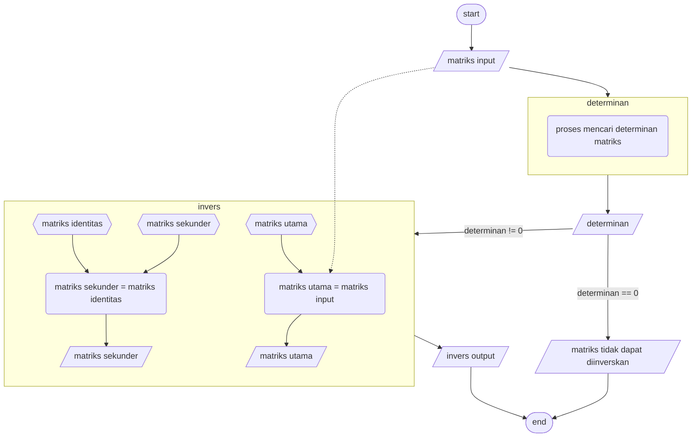

<h1> Invers matriks dengan OBE</h1>
<h3> Dokumentasi ada di main.cpp (dibuat di vscode, makanya dokumentasi jadi satu dalam satu file) </h3>
<h4> Masalah di dalam kode yang belum dibuat: </h4>
<ul>
<li> 
 menentukan determinan menggunakan metode kofaktor (lama) atau menggunakan LU decomposition 
 </li>
<li> 
 membuat logika dari program secara otomatis (ada di file logic.md) 
 </li>
<li> 
 mengalokasikan memori secara efektif (di program) 
 </li>
</ul>

 Hei diriku di masa depan, kuharap kau dapat menyelasaikan proyek gaje ini 

 Diriku di masa ini belum bisa menyelesaikannya secara efektif dan efisien 

 Karena masih banyak hal yang kuketahui soal pemrograman 

<h4> Flowchart program </h4>

 Diedit pada 2 Januari 2023 

