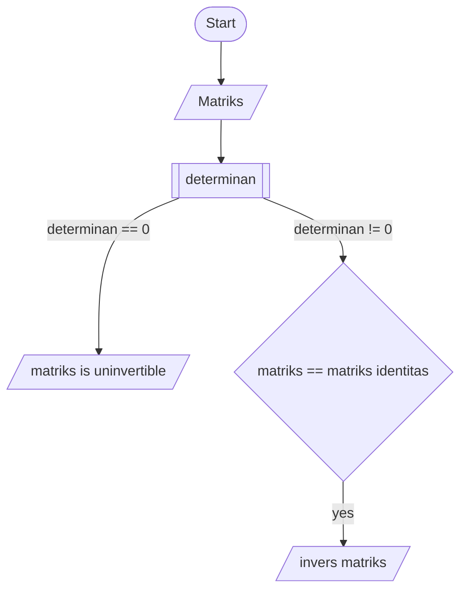

## Flowchart
<p> sedikit ribet emang </p>
<p> link syntax flowchart </p>

```
https://mermaid.js.org/syntax/flowchart.html
```


```mermaid
flowchart TD
  a([Start]) --> b[/Matriks/]
  b --> c[[determinan]]
  c -- determinan == 0 --> d[/"matriks is uninvertible"/]
  c -- determinan != 0 --> e{matriks == matriks identitas}
  e -- yes --> f[/invers matriks/]
```
