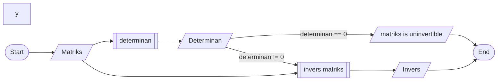
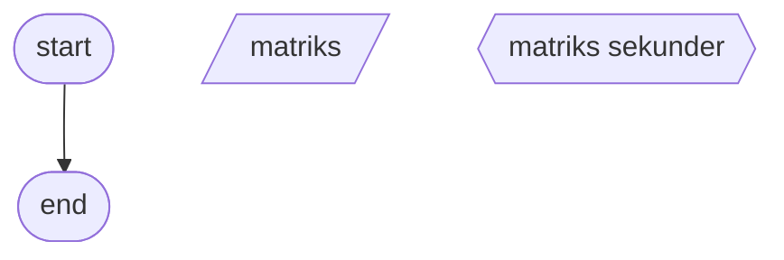

## Flowchart
<p> sedikit ribet emang </p>
<p> link syntax flowchart </p>

```
https://mermaid.js.org/syntax/flowchart.html
```
<h3> Flowchart Utama </h3>


<h3> Sub-Flowchart Determinan </h3>
<p> buat ntar aja, cukup ribet buat kofaktor dengan LU decomposition </p>
<p> kemungkinan cari repositi orang lain </p>
<h3> Sub-Flowchart Invers Matriks </h3>
<p> dua matriks, matriks utama dan matriks sekunder memiliki 3 posisi, diantaranya: </p>


